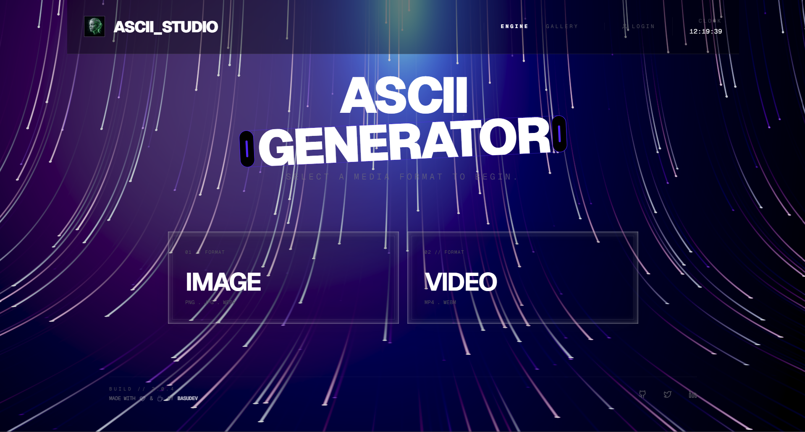
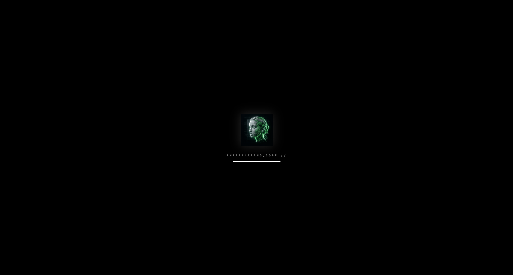
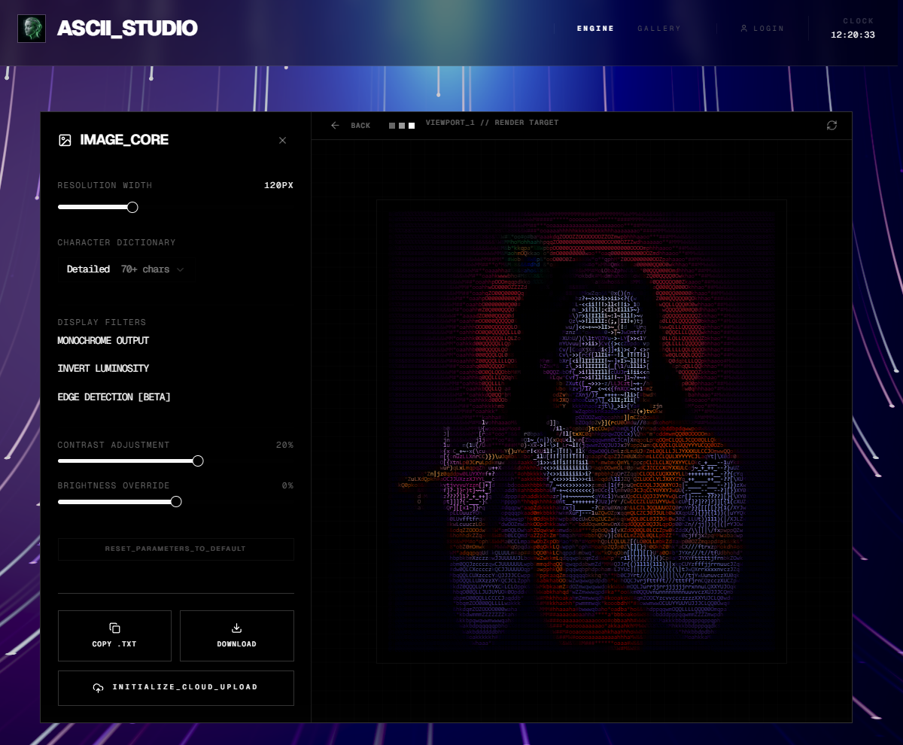
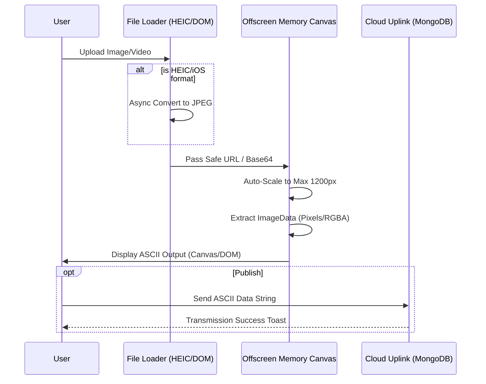
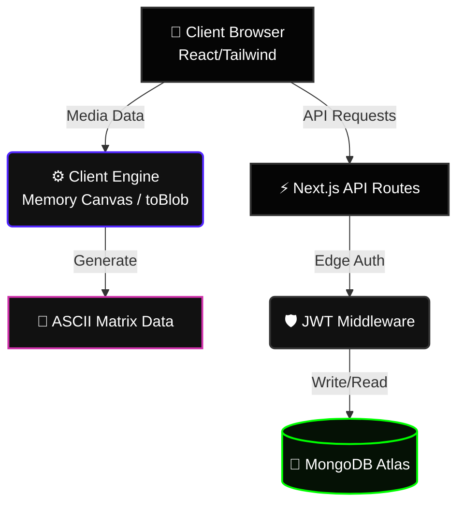

<div align="center">
  <br />
  
  <br />

  <h1 align="center">🌌 ASCII_STUDIO</h1>
  
  <p align="center">
    <strong>A High-Performance Web Engine for Digital Artists & Terminal Enthusiasts</strong>
    <br />
    <br />
    <a href="#-architecture">Architecture</a> •
    <a href="#-features">Features</a> •
    <a href="#-getting-started">Quick Start</a>
  </p>

  
</div>

<br />

> **ASCII_STUDIO** transforms your images and videos into mesmerizing ASCII matrix art using real-time character-density algorithms. Built with a cinematic, highly-animated UX and heavy edge-rendering, it bypasses standard memory limits to handle complex high-res files directly in your browser.

---

## ⚡ Core Features

- **🖼️ Image-to-ASCII Engine**: Convert high-resolution images & HEIC files into colored or monochrome character grids using native mobile-optimized off-screen rendering.
- **🎬 Video-to-ASCII Uplink**: Process video files frame-by-frame on the client side and export them as animated text-based sequences.
- **☁️ Cloud Buffer Gallery**: Archive your best renders to a MongoDB-powered community gallery with real-time UI states.
- **🛡️ Registry Protocol**: Secure user authentication (JWT + JOSE) with persistent edge sessions.
- **📱 Responsive PWA Ready**: Install as a standalone web app for a desktop-like experience on iOS & Android.

<br />

## 📸 Interface Previews

<div align="center">
  
  
</div>

<br />

---

## 🏗️ System Architecture

ASCII Studio employs a modern, serverless **Next.js App Router** architecture with strict edge-client boundaries to maximize performance.

### 🔄 Core Workflow Engine

The conversion workflow is built to bypass mobile memory (`RAM`) crashing limits natively using offscreen canvases:



### 🗄️ Application Topology



---

## 💻 Code Snippets

### ⚙️ Core Character Mapping Algorithm
The engine converts RGBA pixel data into ASCII characters based on luminance calculations:

```typescript
const asciiChars = " .:-=+*#%@"; // Density mapping

// Calculate relative luminance for a pixel
const luminance = (0.299 * r + 0.587 * g + 0.114 * b) / 255;

// Map luminance to character index
const charIndex = Math.floor(luminance * (asciiChars.length - 1));
const asciiChar = asciiChars[charIndex];
```

### 🔒 Edge Authentication Middleware
Protecting API routes with `jose` at the Edge:

```typescript
import { jwtVerify } from 'jose'

export async function middleware(request: NextRequest) {
  const token = request.cookies.get('token')?.value

  if (!token) {
    return NextResponse.json({ error: 'Uplink unauthorized' }, { status: 401 })
  }

  try {
    const secret = new TextEncoder().encode(process.env.JWT_SECRET)
    await jwtVerify(token, secret)
    return NextResponse.next()
  } catch (error) {
    return NextResponse.json({ error: 'Token synchronization failed' }, { status: 401 })
  }
}
```

---

## 🚀 Getting Started

### Prerequisites
- Node.js `18.x` or higher
- MongoDB Atlas Cluster URl

### Local Deployment
```bash
# 1. Clone the repository
git clone https://github.com/CodeWithBasu/Pixel-2-ASCII.git

# 2. Install dependencies
npm install

# 3. Setup environment variables
cp .env.example .env.local

# 4. Initialize the dev server
npm run dev
```

Visit `http://localhost:3000` to enter the studio.

---

<div align="center">
  <p>Built with 🤍 by <strong>Basudev</strong></p>
</div>