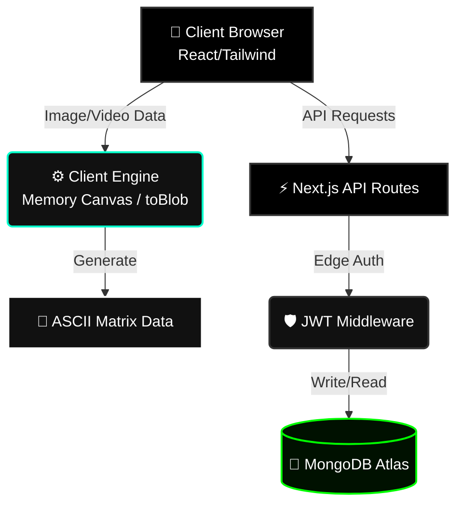
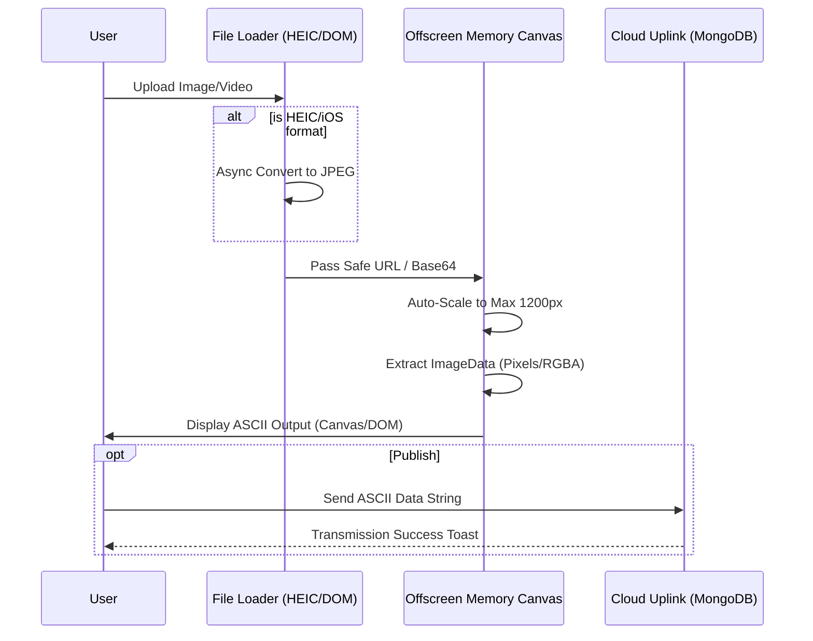

# 🌌 ASCII Studio

<div align="center">
  
  <br/>
  <strong>A High-Performance Web Application for Digital Artists and Terminal Enthusiasts</strong>
</div>

**ASCII Studio** transforms your images and videos into mesmerizing ASCII matrix art using real-time character-density algorithms. With built-in cloud synchronization, you can archive your transmissions and share them with the local community vault. 

Built with mobile-first rendering engines and cinematic UX, ASCII Studio handles complex high-res file processing entirely on edge devices.

---

## ⚡ Key Features

- **🖼️ Image-to-ASCII Engine**: Convert high-resolution images & HEIC files into colored or monochrome character grids using native mobile-optimized off-screen rendering.
- **🎬 Video-to-ASCII Uplink**: Process video files frame-by-frame on the client side and export them as animated text-based sequences.
- **☁️ Cloud Buffer Gallery**: Archive your best renders to a MongoDB-powered community gallery with real-time UI states.
- **🛡️ Registry Protocol**: Secure user authentication (JWT + JOSE) with persistent edge sessions.
- **🖥️ Admin Override**: Specialized dashboard for vault management and transmission purging.
- **📱 Responsive PWA Ready**: Install as a standalone web app for a desktop-like experience on iOS & Android.

---

## 🏗️ System Architecture

ASCII Studio employs a modern, serverless Next.js App Router architecture with strict edge-client boundaries.



## 🔄 Core Workflow Engine

The conversion workflow is built to bypass mobile memory (`RAM`) crashing limits natively:



---

## 📂 Project Structure

```text
Pixel-2-ASCII/
├── app/                  # Next.js App Router Pages & Layouts
│   ├── api/              # Serverless API Endpoints (Auth, Gallery)
│   ├── admin/            # Secure Admin Dashboard
│   ├── gallery/          # Public Community Vault
│   └── page.tsx          # Main Entry & Cinematic Splash
├── components/           # React Functional Components
│   ├── image-to-ascii-converter.tsx  # Core Image Engine
│   └── video-to-ascii-converter.tsx  # Core Video Engine
├── hooks/                # Custom React Hooks (use-responsive, etc)
├── lib/                  # Utilities & Auth Handlers (JOSE/JWT)
├── models/               # Mongoose DB Schemas
├── public/               # Static Assets & PWA Manifest
└── tailwind.config.ts    # Styling Rules & Animations
```

---

## 🛠️ Tech Stack

- **Framework**: [Next.js 16](https://nextjs.org/) (App Router)
- **Library**: [React 19](https://react.dev/) + [Framer Motion 12](https://www.framer.com/motion/)
- **Styling**: [Tailwind CSS 4](https://tailwindcss.com/)
- **Database**: [MongoDB Atlas](https://www.mongodb.com/atlas) + [Mongoose](https://mongoosejs.com/)
- **Auth**: [JWT](https://jwt.io/) + [JOSE](https://github.com/panva/jose)
- **Format Decoders**: [heic2any](https://github.com/alexcorvi/heic2any)

---

## 🚀 Getting Started

### 1. Clone the Node
```bash
git clone https://github.com/CodeWithBasu/Pixel-2-ASCII.git
cd Pixel-2-ASCII
```

### 2. Initialize Dependencies
```bash
npm install
```

### 3. Configure the Grid (.env.local)
Create a `.env.local` file in the root and configure your uplink credentials:
```env
MONGODB_URI=your_mongodb_atlas_uri
JWT_SECRET=your_secure_random_key
ADMIN_EMAIL=your_admin_email@domain.com
```

### 4. Boot System
```bash
npm run dev
```
Open [http://localhost:3000](http://localhost:3000) to begin.

---

## 📜 Admin Protocols
To unlock the **Admin Override** console:
1. Register a new ID using the `ADMIN_EMAIL` specified in your `.env.local`.
2. Access the specialized dashboard at `/admin`.

---

## 📄 License
Created with ☕ and passion by **Basudev**. All transmissions are public under the MIT License.